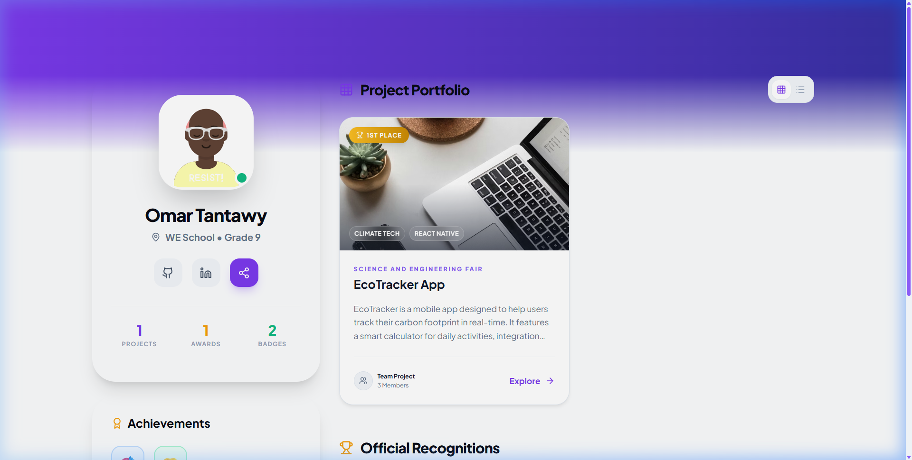
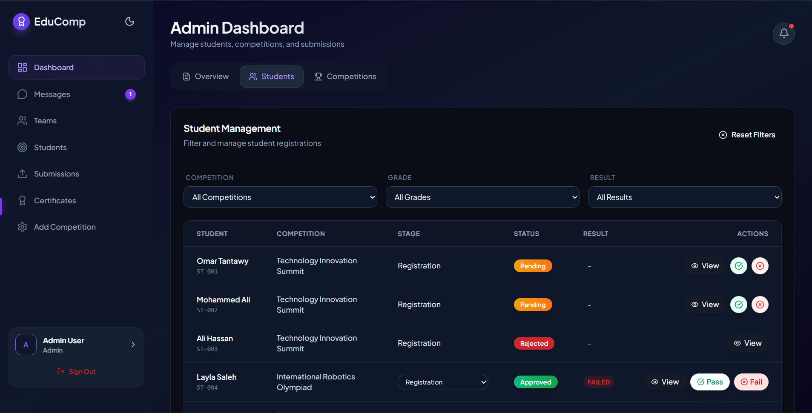
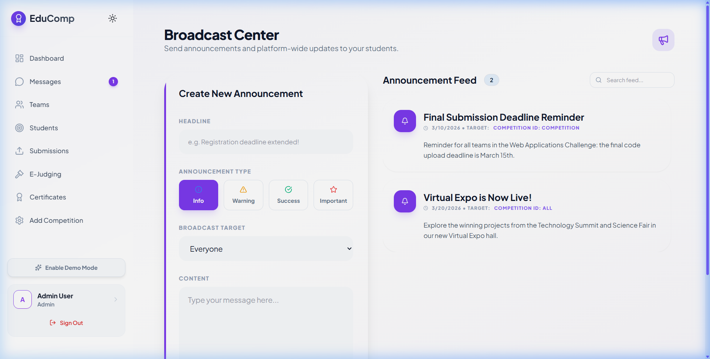
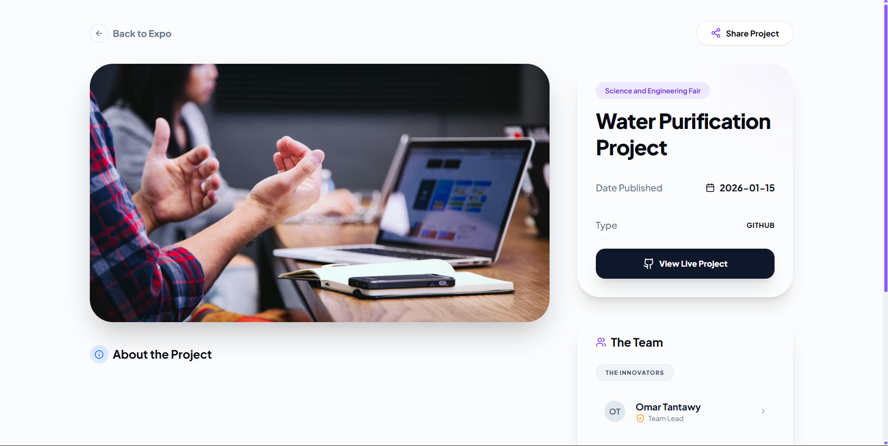
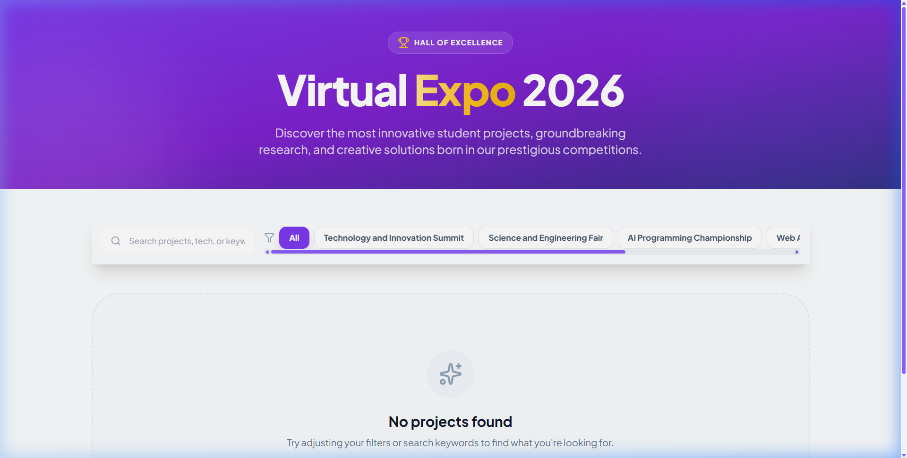

<h1 align="center">
  
  <br/><br/>
  🎓 EduComp
</h1>

<p align="center">
  <strong>The Ultimate Student Competition Management Platform</strong><br/>
  <em>Empowering the next generation of innovators through structured excellence and professional lifecycle management.</em>
</p>

<p align="center">
  
  
  
  
  
</p>

<p align="center">
  
  
  
  
</p>

<p align="center">
  <a href="https://omartantawy360.github.io/edu-por-3"><strong>🚀 Live Demo</strong></a> &nbsp;·&nbsp;
  <a href="#-visual-tour">📸 Visual Tour</a> &nbsp;·&nbsp;
  <a href="#-ecosystems">🌍 Ecosystems</a> &nbsp;·&nbsp;
  <a href="#-competition-lifecycle">🏆 Lifecycle</a> &nbsp;·&nbsp;
  <a href="#-technical-architecture">🧠 Architecture</a> &nbsp;·&nbsp;
  <a href="#-setup--installation">⚡ Setup</a>
</p>

---

## 🌟 Overview

**EduComp** is a premium, full-featured web ecosystem designed to orchestrate academic competitions with professional-grade precision. It serves as a comprehensive platform with specialized, role-aware interfaces for **Students**, **Judges**, and **Administrators** — all synchronized by a state-of-the-art **Competition Lifecycle Engine**.

Built with **React 19** and **Vite 7**, EduComp leverages a sophisticated 6-context modular architecture to handle everything from team formation and AI-powered coaching to rubric-based anonymous peer reviews and automated certificate minting.

> [!IMPORTANT]
> **Phase-Aware UI**: The entire platform is dynamically adaptive. Dashboards, available actions, and visibility states automatically shift as competitions transition through their lifecycle phases — ensuring a seamless journey from initial registration to final result publication.

---

## 📸 Visual Tour

### 🏠 Student Experience

| **Student Dashboard** | **Student Journey Timeline** |
| :---: | :---: |
|  |  |
| *Personalized hub with AI coach, tasks, and active competitions.* | *Visual timeline of competition phases and required actions.* |

| **Student Profile & Portfolio** | **Team Hub & Collaboration** |
| :---: | :---: |
|  |  |
| *Shareable professional profile with verifiable digital accolades.* | *Team management, member recruitment, and group dynamics.* |

---

### ⚖️ Judge Experience

| **Judge Dashboard** | **Evaluation Panel** |
| :---: | :---: |
|  |  |
| *Phase-locked interface that activates during the Judging phase.* | *Interactive rubric-based scoring with real-time total calculation.* |

---

### 🛡️ Admin Center

| **Admin Management Console** | **Admin Judging Oversight** |
| :---: | :---: |
|  |  |
| *Competition wizard, lifecycle control, and conflict resolution.* | *Judge assignment, conflict flagging, and re-assignment tools.* |

| **Admin Broadcast Network** | **Certificate Management** |
| :---: | :---: |
|  |  |
| *Global notification system with real-time unread badges.* | *Print-optimized, verifiable digital certificate generation.* |

---

### 🌐 Platform Showcase

| **Project Showcase & Leaderboard** | **Virtual Expo** |
| :---: | :---: |
|  |  |
| *Live ranking engine with rubric-weighted scores and analytics.* | *Immersive presentation space for finalist projects.* |

---

## 🌍 Ecosystems

EduComp is structured around three dedicated, role-aware portals — each purpose-built for its users' workflow.

### 🎓 1. Student Hub — *The Competitor*

> A personalized command center designed to maximize student performance and professional visibility.

| Feature | Description |
|---|---|
| 🚀 **Dynamic Journey Timeline** | Centralized view of all active competitions, upcoming deadlines, and required actions |
| 🤖 **AI Innovation Coach** | Persistent, context-aware AI assistant providing real-time feedback on project quality, innovation, and pitch decks |
| 👥 **Anonymous Peer Review** | Fair, rubric-based evaluation system where students review peer projects to promote critical thinking |
| 🌟 **Professional Portfolios** | Automated, shareable profiles showcasing skills, project history, and verifiable digital badges |
| 🧐 **Granular Judge Feedback** | Detailed score breakdowns across rubric criteria with personalized judge comments once results are published |
| 🤝 **Team Forge** | Advanced tools for forming teams, recruiting members, and managing group dynamics |
| 💬 **Synergy Chat** | Real-time communication integrated directly into the team workflow |
| 🏅 **Digital Certificates** | Instantly accessible, print-ready certificates upon competition conclusion |

---

### ⚖️ 2. Judge Portal — *The Evaluator*

> A streamlined, distraction-free interface focused entirely on objective, phase-locked assessment.

| Feature | Description |
|---|---|
| 🔒 **Phase-Locked Evaluation** | Judging panels only activate when the competition enters the 'Evaluation' phase — ensuring data integrity |
| 📋 **Master Rubrics** | Interactive scoring sheets dynamically assigned by admins (Standard, Science, Coding) with criteria-specific weights |
| ⚡ **Real-time Totals** | Scores calculate and update in real time as judges fill in rubric criteria |
| 🚩 **Conflict Flagging** | Integrated system for judges to report conflicts of interest, triggering automated admin reassignment |
| 💬 **Qualitative Feedback** | Dedicated channels for providing detailed constructive criticism alongside quantitative scores |

---

### 🛡️ 3. Admin Center — *The Orchestrator*

> The mission control for complex educational initiatives — complete oversight from creation to archival.

| Feature | Description |
|---|---|
| 🧙‍♂️ **Competition Wizard** | Guided multi-step engine for managing the full lifecycle, with settings for team sizes and rubric assignment |
| 📊 **Rank Engine & Analytics** | Real-time leaderboard generation with visual summaries for Registrations, Submission Rates, and Average Scores |
| ⚖️ **Conflict Resolution Console** | Centralized hub for reviewing judge-flagged conflicts and securely re-assigning evaluators |
| 📢 **Broadcast Network** | Global notification system with real-time unread badges, targeted alerts, and a mark-as-read drawer |
| 📜 **Certificate Mint** | Generation of professional, print-optimized, verifiable digital certificates |
| 🏁 **Result Finalization** | Secure bridging action linking judicial scores into official competition results |
| 👩‍⚖️ **Judge Management** | Full CRUD of judge accounts, role assignments, and competition linkage |

---

## 🏆 Competition Lifecycle

The platform enforces a professional **7-stage lifecycle** with strict phase guards. A real-time **Global Phase Banner** appears across all user dashboards as competitions transition between states.


| Phase | Who's Active | What Happens |
|---|---|---|
| **1. Draft** | Admin | Rules, rubric selection (Science / Coding / Standard), and demographics configured |
| **2. Registration** | Students | Competitions appear on dashboards; teams enroll and submit initial documents |
| **3. Evaluation** | Judges | Expert panels score projects using assigned professional rubrics |
| **4. Peer Review** | Students | Finalists evaluate each other's work to broaden perspective |
| **5. Results Ready** | Admin | Admin verifies rankings, audits score consistency, triggers finalization |
| **6. Published** | Everyone | Results go live; feedback unlocks for students; certificates become available |
| **7. Archived** | Admin | Competition is sealed and preserved for institutional records |

> [!NOTE]
> **Lifecycle Guards** are enforced at the API and UI level. Students cannot submit after the Registration phase closes. Judges cannot score outside the Evaluation phase. These are not just UI hints — they are enforced server-side.

---

## 🧠 Technical Architecture

### 🛡️ 6-Context State Management

EduComp's architecture isolates concerns into six independent React contexts, preventing cascading re-renders across concurrent user workflows:

```
src/
├── context/
│   ├── AuthContext.jsx        → Identity, role-based routing, session persistence
│   ├── AppContext.jsx         → Competition data, lifecycle phases, phase guards
│   ├── TeamContext.jsx        → Many-to-many: students ↔ teams ↔ registrations
│   ├── ChatContext.jsx        → Real-time message streams
│   ├── JudgeContext.jsx       → Rubric assignments, flaggedSubmissions, unflagConflict
│   └── NotificationContext.jsx → Broadcast service, unread badges, action-triggered alerts
```

| Context | Responsibility |
|---|---|
| **AuthContext** | Secure identity, `student` / `judge` / `admin` role-based routing, and session persistence |
| **AppContext** | Primary source of truth for competition data, lifecycle phases, and global phase guards |
| **TeamContext** | Complex many-to-many relationships between students, teams, and competition registrations |
| **ChatContext** | Manages real-time message streams for team communication |
| **JudgeContext** | Orchestrates evaluation data, rubric assignments, and conflict flag management |
| **NotificationContext** | Robust broadcast service for targeted alerts, interactive badging, and global messages |

---

### 🎨 Technology Stack

| Layer | Technology | Purpose |
|---|---|---|
| **UI Framework** | [React 19](https://react.dev/) | Concurrent features, optimized rendering, Fast Refresh |
| **Build Tool** | [Vite 7](https://vitejs.dev/) | Lightning-fast HMR and optimized production bundles |
| **Design System** | [Tailwind CSS 3](https://tailwindcss.com/) | Glassmorphism-inspired utility-first styling with `clsx` + `tailwind-merge` |
| **Animations** | [Framer Motion 11](https://www.framer.com/motion/) | Hardware-accelerated micro-interactions and page transitions |
| **Icons** | [Lucide React](https://lucide.dev/) | Professional, consistent iconography |
| **AI Layer** | Google Gemini API | Context-aware coaching, feedback generation, and QA simulation |
| **Real-time** | Socket.IO | Live team chat and notification push |
| **Routing** | React Router v6 | Role-aware nested routing with lazy loading |

---

### 📁 Project Structure

```
edu-por-3/
├── public/                    # Static assets & PWA manifest
├── src/
│   ├── api/                   # Axios instances & API service layer
│   ├── components/
│   │   ├── Layout/            # DashboardLayout, Sidebar, Topbar
│   │   ├── ui/                # Reusable UI: AIAssistant, NotificationDrawer, Leaderboard
│   │   └── QA/                # QASimulator component
│   ├── context/               # 6-context state architecture
│   ├── pages/
│   │   ├── admin/             # AdminDashboard, CertificateManagement, JudgeManagement
│   │   ├── StudentDashboard   # Student hub, journey, and profile pages
│   │   ├── TeamsPage          # Team formation and management
│   │   └── Register / Login   # Authentication flows
│   └── main.jsx               # App entrypoint with context providers
├── docs/
│   └── screenshots/           # Platform screenshots (12 views)
└── vite.config.js
```

---

## ⚡ Setup & Installation

### Prerequisites

- **Node.js** 18.x or higher
- **npm** 9.x or higher (or yarn)

### Quick Start

```bash
# 1. Clone the repository
git clone https://github.com/omartantawy360/edu-por-3.git
cd edu-por-3

# 2. Install dependencies
npm install

# 3. Start the development server
npm run dev
```

The app will be available at `http://localhost:5173`.

### Build for Production

```bash
# Create an optimized production bundle
npm run build

# Preview the production build locally
npm run preview
```

### Environment Variables

Create a `.env` file in the project root:

```env
VITE_API_URL=https://your-backend-url.railway.app
VITE_GEMINI_API_KEY=your_gemini_api_key
VITE_GOOGLE_CLIENT_ID=your_google_oauth_client_id
```

---

## 🗺️ Roadmap

- [x] 7-phase competition lifecycle with real-time phase banners
- [x] AI Innovation Coach (Gemini-powered)
- [x] Role-based routing: Student / Judge / Admin
- [x] Rubric-based anonymous judging with conflict flagging
- [x] Real-time notifications with broadcast network
- [x] Print-optimized digital certificate generation
- [x] Virtual Expo showcase for finalist projects
- [ ] Mobile-native PWA with offline support
- [ ] Multi-institution support (university federation mode)
- [ ] Advanced analytics dashboard with export to CSV/PDF
- [ ] Public competition discovery marketplace

---

## 🤝 Contributing

Contributions are welcome! Please follow these steps:

1. Fork the repository
2. Create your feature branch: `git checkout -b feature/your-feature`
3. Commit your changes: `git commit -m 'feat: add your feature'`
4. Push to the branch: `git push origin feature/your-feature`
5. Open a Pull Request

---

## 📄 License

This project is licensed under the **MIT License** — see the [LICENSE](LICENSE) file for details.

---

<p align="center">
  <strong>Built with ❤️ for the Global Student Community</strong><br/>
  <em>EduComp — Where Academic Excellence Meets Professional Precision</em>
</p>

<p align="center">
  <a href="https://omartantawy360.github.io/edu-por-3">🌐 Live Demo</a> &nbsp;·&nbsp;
  <a href="https://github.com/omartantawy360/edu-por-3/issues">🐛 Report Bug</a> &nbsp;·&nbsp;
  <a href="https://github.com/omartantawy360/edu-por-3/issues">✨ Request Feature</a>
</p>
