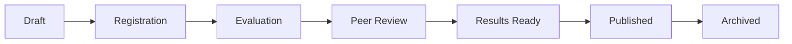

# <p align="center">🎓 EduComp</p>

<p align="center">
  <strong>The Ultimate Student Competition Management Platform</strong><br>
  <em>Empowering the next generation of innovators through structured excellence and professional lifecycle management.</em>
</p>

<p align="center">
  
  
  
  
  
</p>

<p align="center">
  <a href="https://omartantawy360.github.io/edu-por-3"><strong>🚀 Live Demo</strong></a> | 
  <a href="#-visual-tour">Visual Tour</a> | 
  <a href="#-ecosystems">Ecosystems</a> | 
  <a href="#-competition-lifecycle">Lifecycle</a> | 
  <a href="#-technical-architecture">Architecture</a> | 
  <a href="#-setup--installation">Setup</a>
</p>

---

## 🌟 Overview

**EduComp** is a premium, high-performance web ecosystem designed to orchestrate academic competitions with professional-grade precision. It serves as a comprehensive platform with specialized, role-aware interfaces for **Students**, **Judges**, and **Administrators**—all synchronized by a state-of-the-art **Competition Lifecycle Engine**.

Built with **React 19** and **Vite 7**, EduComp leverages a sophisticated modular architecture to handle everything from team formation and AI-powered coaching to rubric-based anonymous peer reviews and automated certificate minting.

> [!IMPORTANT]
> **Phase-Aware UI**: The entire platform is dynamically adaptive. Dashboards, available actions, and visibility states automatically shift as competitions transition through their lifecycle, ensuring a seamless journey from initial registration to final result publication.

---

## 📸 Visual Tour

### 🏙️ Command & Control
| **Student Hub & AI Coach** | **Admin Competition Orchestrator** |
| :---: | :---: |
|  |  |
| *Personalized timeline, task list, and AI assistant.* | *Dynamic workflow management and phase control.* |

### 📊 Intelligence & Recognition
| **Advanced Admin Analytics** | **Automated Leaderboards** |
| :---: | :---: |
|  |  |
| *Real-time metrics on registration and performance.* | *Live ranking engine with rubric-weighted scores.* |

---

## 🌍 Ecosystems

### 🎓 1. Student Hub (The Competitor)
Designed to foster student growth and professional visibility.
- **🚀 Dynamic Journey Timeline**: A centralized view of all active competitions, upcoming deadlines, and required actions.
- **🤖 AI Innovation Coach**: A persistent, context-aware AI assistant providing real-time feedback on project innovation, technical feasibility, and pitch deck quality.
- **👥 Anonymous Peer Review**: A fair, rubric-based evaluation system where students review peer projects, promoting critical thinking and community feedback.
- **🌟 Professional Portfolios**: Automated, sharable profiles showcasing skills, project history, and verifiable digital accolades.
- **🧐 Granular Judge Feedback**: Once results are published, students can view detailed breakdowns of their scores across multiple rubric criteria, alongside personalized judge comments.
- **🤝 Team Forge**: Advanced collaboration tools for forming teams, recruiting members, and managing group dynamics.
- **💬 Synergy Chat**: Real-time communication channel integrated directly into the team workflow.

### ⚖️ 2. Judge Portal (The Evaluator)
A streamlined, high-focus interface for objective assessment.
- **🔒 Phase-Locked Evaluation**: Judging panels only activate when the competition enters the 'Evaluation' phase, ensuring data integrity.
- **📋 Master Rubrics**: Interactive scoring sheets dynamically assigned by admins (Standard, Science, Coding) with criteria-specific weights and real-time total calculation.
- **🚩 Conflict Flagging**: Integrated system for judges to report conflicts of interest, triggering automated admin reassignment.
- **💬 Qualitative Feedback**: Dedicated channels for providing detailed constructive criticism alongside quantitative scores.

### 🛡️ 3. Admin Center (The Orchestrator)
The mission control for complex educational initiatives.
- **🧙‍♂️ Competition Wizard**: A guided, multi-step engine for managing the entire lifecycle—from draft to archival. Includes granular settings for team sizes and rubric assignment.
- **📊 Rank Engine & Analytics**: Real-time leaderboard generation based on complex scoring models. Includes visual summaries for Total Registrations, Submission Rates, and Average Scores.
- **⚖️ Conflict Resolution Console**: Centralized hub for reviewing judge-flagged conflicts and securely re-assigning evaluators to maintain fairness.
- **📢 Broadcast Network**: Global notification system equipped with real-time unread badges, targeted alerts (e.g., student accepted, results published), and a mark-as-read drawer.
- **📜 Print-Optimized Certificate Mint**: Generation of professional, verifiable digital certificates explicitly optimized for perfect high-resolution printing.
- **🏁 Result Finalization**: A secure bridging action linking disparate judicial scores into official competition results to conclude the event.

---

## 🏆 Competition Lifecycle
The platform enforces a professional, 6-stage lifecycle to ensure fairness and strict phase control. Global Phase Banners provide real-time status across all user dashboards:



1.  **Draft**: Rules, admin-selected rubrics (e.g., Science vs. Coding), and entry demographics are configured.
2.  **Registration**: Competitions appear on student dashboards; teams enroll and submit initial documents. Lifecycle guards prevent submissions after this phase.
3.  **Evaluation (Judging)**: Expert panels review projects using their assigned professional rubrics.
4.  **Peer Review**: Finalists evaluate each other's work to broaden perspective.
5.  **Results Ready**: Admin verifies top rankings, audits score consistency, and triggers the `finalizeCompetitionResults` action.
6.  **Results Published**: Results go live globally; detailed judge feedback unlocking for students; certificates are minted and ready for print.

---

## 🧠 Technical Architecture

### 🛡️ State Management & Context Architecture
EduComp utilizes a sophisticated **6-Context Architecture** to maintain high performance and prevent unnecessary cascading re-renders across concurrent workflows:
- **AuthContext**: Manages secure identity, role-based routing (`student`, `judge`, `admin`), and session persistence.
- **AppContext**: The primary source of truth for competition data, lifecycle phases, and global configurations (Phase Guards).
- **TeamContext**: Handles complex many-to-many relationships between students, teams, and registrations.
- **ChatContext**: Manages real-time message streams.
- **JudgeContext**: Orchestrates evaluation data, rubric assignments, and manages `flaggedSubmissions` / `unflagConflict` logic.
- **NotificationContext**: A robust broadcast service for targeted alerts, interactive badging, and action-triggered global messages.

### 🎨 Visual & Performance Engineering
- **Logic**: [React 19](https://react.dev/) — Leveraging the latest concurrent features, optimized rendering patterns, and Fast Refresh compatibility.
- **Build**: [Vite 7](https://vitejs.dev/) — Lighting-fast HMR and optimized production bundles.
- **Design System**: [Tailwind CSS](https://tailwindcss.com/) — A premium glassmorphism-inspired design system with complex dynamic class generation using `clsx` and `tailwind-merge`.
- **Icons**: [Lucide-React](https://lucide.dev/) — Professional, consistent iconography.
- **Animations**: [Framer Motion](https://www.framer.com/motion/) — Smooth, hardware-accelerated micro-interactions for elevated UX.

---

## ⚡ Setup & Installation

### Prerequisites
- Node.js 18.x or higher
- npm or yarn

### Quick Start
1. **Clone the Repository**
   ```bash
   git clone https://github.com/omartantawy360/edu-por-3.git
   cd edu-por-3
   ```
2. **Install Dependencies**
   ```bash
   npm install
   ```
3. **Run Development Server**
   ```bash
   npm run dev
   ```
4. **Build for Production**
   ```bash
   npm run build
   ```

---

## 📄 License
This project is licensed under the **MIT License**.

<p align="center">
  <strong>Built with ❤️ for the Global Student Community</strong>
</p>

