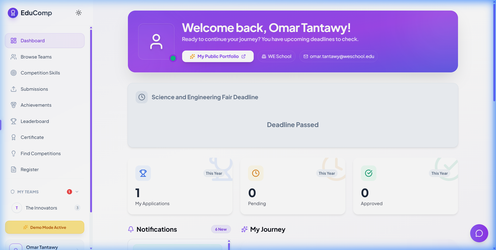

# <p align="center">🎓 EduComp</p>

<p align="center">
  <strong>The Ultimate Student Competition Management Platform</strong><br>
  <em>Empowering the next generation of innovators through structured excellence and professional lifecycle management.</em>
</p>

<p align="center">
  
  
  
  
</p>

<p align="center">
  <a href="https://omartantawy360.github.io/edu-por-3"><strong>🚀 Live Demo</strong></a> | 
  <a href="#-visual-tour">Visual Tour</a> | 
  <a href="#-ecosystems">Ecosystems</a> | 
  <a href="#-competition-lifecycle">Lifecycle</a> | 
  <a href="#-architecture">Architecture</a> | 
  <a href="#-getting-started">Setup</a>
</p>

---

## 🌟 Overview

**EduComp** is a premium, high-performance web ecosystem designed to orchestrate academic competitions. It serves as a comprehensive platform with specialized interfaces for Students, Judges, and Administrators—now powered by a state-of-the-art **Competition Lifecycle Engine**.

> [!IMPORTANT]
> **Dynamic Adaptation**: The entire platform is phase-aware. Dashboards, actions, and visibility states automatically shift as competitions transition through their lifecycle, ensuring a seamless journey from registration to results.

---

## 📸 Visual Tour

### 🖥️ The Student & Admin Experience
| **Student Journey Timeline** | **Admin Competition Wizard** |
| :---: | :---: |
|  |  |
| *Visual milestone tracker for all student activities.* | *Guided 4-step workflow for lifecycle management.* |

### 🏆 Results & Analytics
| **Rich Result Banners** | **Score Breakdown** |
| :---: | :---: |
|  |  |
| *Premium Pass/Fail feedback for competitors.* | *Granular performance data (Innovation, Design, Technical).* |

---

## 🌍 Ecosystems

### 🎓 1. Student Hub (Competitor)
The heart of the competitor experience, designed for growth and visibility.
- **🚀 Dynamic Dashboard**: A unified timeline of registered competitions, pending tasks, and team milestones.
- **🌟 Public Portfolios**: Professional, sharable profiles that showcase achievements, skills, and past projects.
- **🤝 Team Forge**: Advanced collaboration tools including team formation, role assignment, and recruitment.
- **💬 Synergy Chat**: Built-in, real-time communication for team coordination and project development.
- **📜 Digital Vault**: Instant access to verifiable certificates and past accolades.

### ⚖️ 2. Judge Portal (Evaluation)
A specialized, focused interface for fair and efficient assessment.
- **🔒 phase-Locked Evaluation**: Judging panels only activate during the evaluation phase to prevent unauthorized scoring.
- **📋 Rubric Architect**: Interactive, criteria-based scoring with real-time total calculation.
- **🛰️ Progress Tracker**: Visual overview of assigned projects, showing which are ready for review vs. still in draft.
- **💬 Feedback loop**: Direct qualitative feedback field alongside quantitative scores.

### 🛡️ 3. Admin Command Center (Orchestrator)
The brain of the operation, balancing guided workflows with granular control.
- **🧙‍♂️ Competition Wizard**: A guided 4-step engine (Select → Registration → Scoring → Publish) for bulk lifecycle management.
- **📢 Broadcast Network**: Centralized "Smart Announcement" center for targeted system notifications.
- **🛠️ Dual-Mode Registry**: Seamlessly switch between read-only Directory views and granular edit modes.
- **📊 Rank Engine**: Automated leaderboard generation with real-time ranking based on complex rubric weights.
- **💎 Certificate Mint**: Dynamic template-based generation for competition winners and participants.

### 🏛️ 4. Public Arena (Exposure)
The public-facing showcase for institutional excellence.
- **🔥 Virtual Expo**: A dynamic gallery of the most innovative student projects across all competitions.
- **🖼️ Project Showcases**: Rich detail pages featuring team credits, media galleries, and technical descriptions.
- **🌍 Global Recognition**: Public permalinks for projects and profiles to facilitate external sharing.

---

## 🏆 Competition Lifecycle
The platform enforces a strict, professionally modeled competition workflow:

1. **Draft / Setup** — Admin configures rules, rubrics, and demographics.
2. **Registration Open** — Competitions appear on student dashboards; teams form and enroll.
3. **Evaluation (Judging)** — Judging portals open; rubric-based scoring commences.
4. **Results Ready** — Admin reviews final rankings and verifies leaderboard integrity.
5. **Results Published** — Results go live; student banners appear; certificates are minted.
6. **Archived** — Data is preserved for historical analytics and long-term portfolio value.

---

## 🛠️ Architecture & Tech Stack

### 🧠 Strategic State Management
The project utilizes a sophisticated **6-Context React Architecture** for modularity and performance:
- **AuthContext**: Identity management, role-based access, and session persistence.
- **AppContext**: Core competition data, lifecycle state, and system-wide configurations.
- **TeamContext**: Intricate team relationship mapping, recruitment, and management.
- **ChatContext**: Real-time message streaming and cross-team communication.
- **JudgeContext**: Specialized evaluation state and rubric-to-score transformations.
- **ThemeContext**: Dynamic UI palette management (including Sleek Dark Mode).

### 🎨 Visual Identity & Engineering
- **Logic**: [React 19](https://react.dev/) — Optimized using Concurrent Mode and highly efficient rendering patterns.
- **Styling**: [Tailwind CSS](https://tailwindcss.com/) — Premium glassmorphism-inspired design system with zero runtime CSS overhead.
- **Animations**: [GSAP](https://gsap.com/) — High-performance micro-animations for an "alive" UI feel.
- **Build**: [Vite 7](https://vitejs.dev/) — Lighting-fast HMR and build optimization for modern web standards.

---

## ⚡ Getting Started

### Quick Setup

1. **Clone & Enter**
   ```bash
   git clone https://github.com/omartantawy360/edu-por-3.git
   cd edu-por-3
   ```

2. **Install Dependencies**
   ```bash
   npm install
   ```

3. **Launch Dev Environment**
   ```bash
   npm run dev
   ```

---

## 📄 License
Distributed under the **MIT License**. Created with a passion for academic innovation.

<p align="center">
  <strong>Built with ❤️ for the Global Student Community</strong>
</p>
