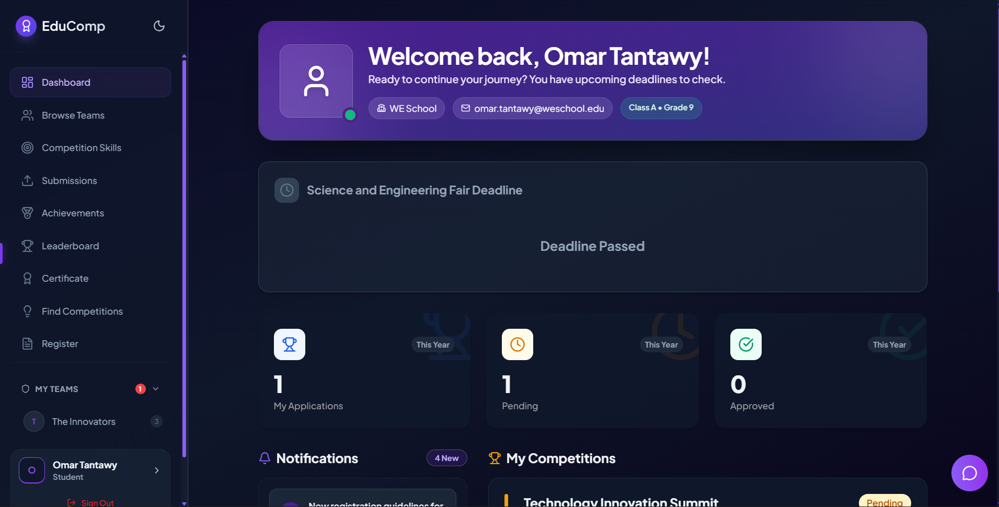
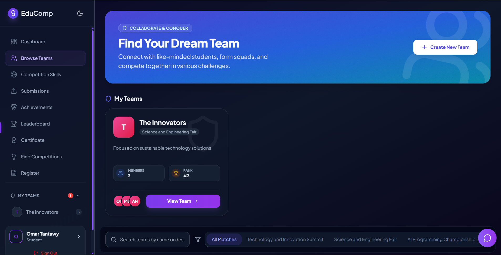
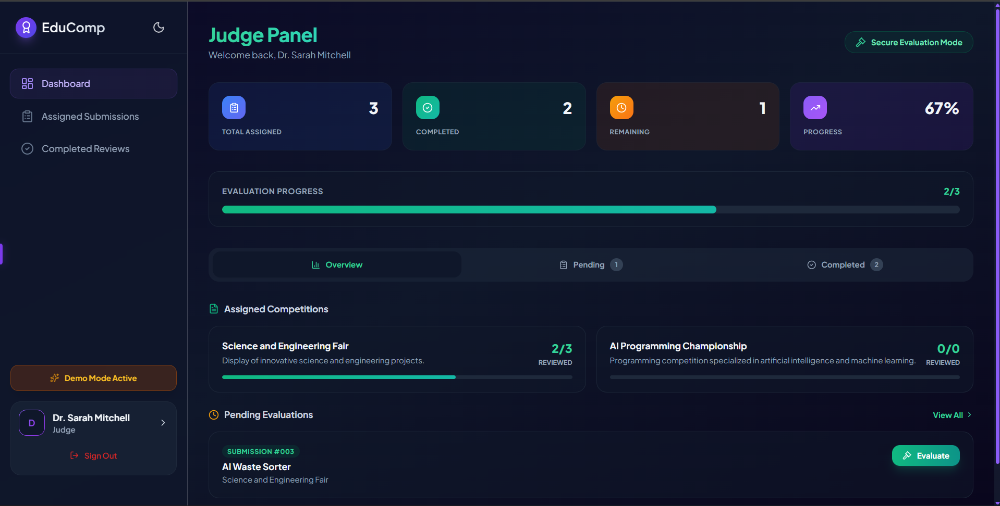
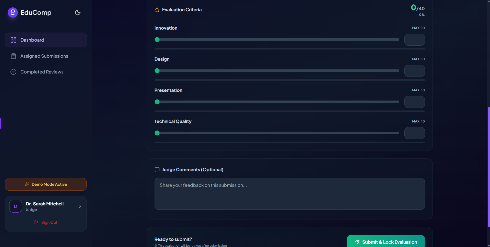
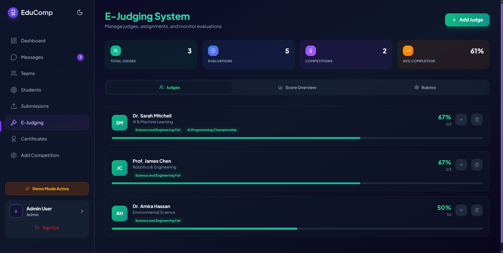
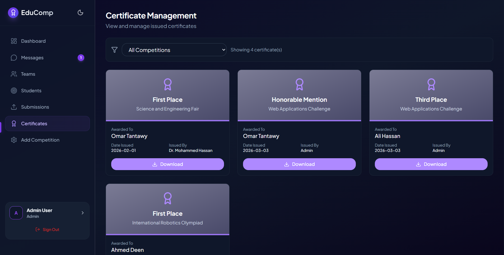

# <p align="center">🎓 EduComp</p>

<p align="center">
  <strong>The Ultimate Student Competition Management Platform</strong><br>
  <em>Empowering the next generation of innovators through structured excellence.</em>
</p>

<p align="center">
  
  
  
  
</p>

<p align="center">
  <a href="https://omartantawy360.github.io/edu-por-3"><strong>🚀 Live Demo</strong></a> | 
  <a href="#-visual-tour">Visual Tour</a> | 
  <a href="#-core-features">Features</a> | 
  <a href="#-architecture">Architecture</a> | 
  <a href="#-getting-started">Setup</a>
</p>

---

## 🌟 Overview

**EduComp** is a high-performance, premium web ecosystem designed to orchestrate academic competitions. It serves as a comprehensive platform with three distinct interfaces: a collaborative **Student Hub**, a specialized **Judge Portal**, and a powerful **Admin Command Center**.

> [!IMPORTANT]
> **Vision**: EduComp isn't just a management tool; it's a launchpad. Built with **React 19** and a custom **Multi-Context State Engine**, it delivers a seamless, professional experience for students, judges, and administrators alike.

---

## 📸 Visual Tour

### 🖥️ The Student Hub
| **Personal Dashboard** | **Team Collaboration** |
| :---: | :---: |
|  |  |
| *Track your progress, achievements, and upcoming deadlines.* | *Real-time chat and centralized project strategy.* |

### ⚖️ The Judge Portal
| **Judge Dashboard** | **Anonymous Evaluation** |
| :---: | :---: |
|  |  |
| *Monitor assigned submissions and review progress.* | *Score projects fairly with anonymized data and rubrics.* |

### 🛡️ The Admin Command Center
| **Judge & Rubric Management** | **Digital Certification** |
| :---: | :---: |
|  |  |
| *Orchestrate the judging flow and build custom rubrics.* | *Issue verifiable accolades with a single click.* |

---

## 🎯 Core Features

### 🎓 For Competitors (Students)
- **🚀 Personalized HUD**: A unified view of current competitions, team status, and skill progression.
- **🤝 Team Forge**: Advanced team building tools including member search and real-time invitations.
- **💬 Synergy Chat**: Built-in communication channels for seamless project planning and file tracking.
- **📊 AI-Driven Recommendations**: Smart skill-based suggestions for which competitions match your profile best.
- **🏆 Gamified Leaderboards**: Real-time rankings powered by synchronized judge evaluations.
- **📜 Verifiable Accolades**: Instant access to digital certificates upon successful completion of any event.

### ⚖️ For Professional Judges
- **🛡️ Anonymous Evaluation**: Complete isolation of student identifying data to ensure unbiased judging.
- **📊 Interactive Rubrics**: Dynamic scoring system with clear criteria and real-time total calculation.
- **🔒 Evaluation Locking**: Secure submission process that prevents post-submission score manipulation.
- **📈 Progress Tracking**: Visual indicators of pending, completed, and overall review statistics.

### 🛡️ For Orchestrators (Administrators)
- **🗂️ Unified Registry**: Full CRUD control over student profiles, team configurations, and school data.
- **⚖️ E-Judging Command**: Manage judge roles, assign evaluations, and monitor judging progress at scale.
- **🛠️ Rubric Architect**: Build and customize evaluation criteria for every competition independently.
- **💎 Certificate Mint**: Dynamic certificate generation system with customizable templates.
- **📢 Broadcast Network**: Mass notification system to keep all users updated instantly.
- **📈 Institutional Analytics**: Deep insights into judging variance and overall participation metrics.

---

## 🛠️ Tech Stack

Built with a focus on **Visual Excellence** and **Performance**.

| Layer | Technology | Rationale |
| :--- | :--- | :--- |
| **Logic** | [React 19](https://react.dev/) | Utilizing Concurrent Mode and Transitions for sub-second UI response. |
| **Style** | [Tailwind CSS](https://tailwindcss.com/) | For a utility-first, performant glassmorphic UI with zero runtime overhead. |
| **Motion** | [GSAP](https://gsap.com/) | Professional-grade micro-animations managed via a high-performance engine. |
| **Engine** | [Vite 7](https://vitejs.dev/) | Optimized HMR and lightning-fast build cycles for modern web standards. |
| **Routing** | [React Router 7](https://reactrouter.com/) | Sophisticated nested routing for multi-dashboard layouts. |
| **State** | React Context | Clean, scalable state management across six specialized contexts (Auth, App, Team, Chat, Theme, Judge). |

---

## 📂 Architecture

### Directory Structure
```bash
src/
├── components/
│   ├── ui/             # Reusable atomic molecules (Cards, Buttons, RubricBuilder)
│   └── Layout/         # Primary structural components (Sidebar, Navbar)
├── context/            # Multi-provider context architecture (Auth, App, Team, Chat, Judge)
├── pages/
│   ├── admin/          # Exclusive administrative viewports and management
│   ├── judge/          # Judge-specific interfaces (Dashboard, Evaluation)
│   └── (root)/         # Student-facing hubs and dashboards
├── utils/              # Logic abstractions and style merging (cn utility)
└── styles/             # Tailwind directives and CSS variables
```

---

## ⚡ Getting Started

### Prerequisites
* **Node.js**: v18.0.0+
* **System**: Windows, macOS, or Linux

### Quick Installation

1. **Clone the Infrastructure**
   ```bash
   git clone https://github.com/omartantawy360/edu-por-3.git
   cd edu-por-3
   ```

2. **Initialize Environment**
   ```bash
   npm install
   ```

3. **Launch Development Suite**
   ```bash
   npm run dev
   ```

4. **Production Compilation**
   ```bash
   npm run build
   ```

---

## 🌍 Deployment

This repository is optimized for **GitHub Pages**.

1. Update the `base` in `vite.config.js` to match your repository name.
2. Run `npm run build` to generate the production bundle.
3. Use `npm run deploy` (configured with `gh-pages`) to push to the live site.

---

## 🤝 Contribution Guidelines

We welcome innovation! Whether it's a bug fix or a bold new feature:
1. **Fork** the repository.
2. **Create** a feature branch (`git checkout -b feature/AmazingFeature`).
3. **Commit** your changes (`git commit -m 'Add some AmazingFeature'`).
4. **Push** to the branch (`git push origin feature/AmazingFeature`).
5. **Open** a Pull Request.

---

## 📄 License & Legal

Distributed under the **MIT License**. Created with a passion for student-led innovation.

<p align="center">
  <strong>Built with ❤️ for the Global Student Community</strong>
</p>
